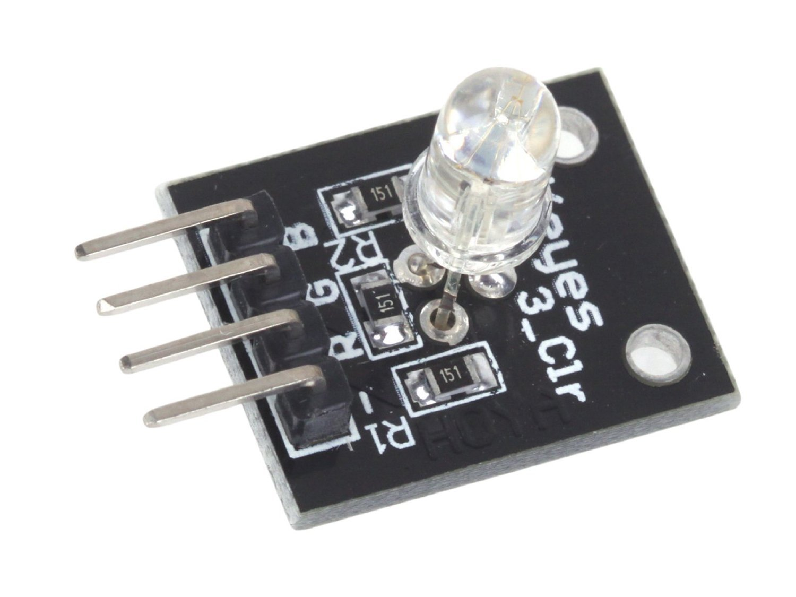

## 
 三色LED模块(RGB) ##

- **注意**：
  - **绿色和蓝色及其刺眼，注意通电时不要直盯**
- 概述：
> &emsp;&emsp;RGB LED 模块由一个插件全彩 LED 制成，通过 R G B三色来显示不同的颜色。 
  &emsp;&emsp; 可以同时给三引脚进行高电进行白光显示。
- 产品参数：
1. 工作电压：5V
2. LED 驱动模式：共阴驱动

- 引脚说明：
  - R 红色
  - G 绿色
  - B 蓝色
  - \- GND
- 注意：
  - 绿色和蓝色及其刺眼，注意通电时不要直盯