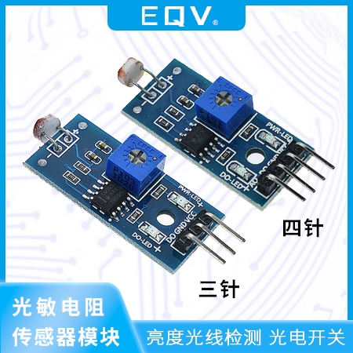

## <center> 光敏电阻传感器模块 ##
- > 亮度光线检测 光电开关
- 
- 产品特点
  - 比较器输出，信号干净，驱动能力强，超过15mA
  - 配可调电位器可调节检测信号光线亮度
  - 工作电压3V-5V
  - 输出形式：DO数字开关输出(0-1),和AO模拟电压输出
  - PCB尺寸：31mm\*14mm
- 使用说明
  - 光敏电阻模块对环境光线很敏感，一般用来检测周围环境的亮度，触发单片机或继电器模块。
  - 环境光线亮度达不到设定阀值的话，DO端输出高电平，当外界环境超过设定阀值，输出低电平。
  - AO可以与AD模块相连，通过AD转换，可以获得环境光强更精准的数值。
- 引脚说明
  - VCC &emsp;&emsp;&emsp;3.3-5v
  - GND&emsp;&emsp;&emsp; 接地
  - DO&emsp;&emsp;&emsp; TTL数字信号输出
  - AD&emsp;&emsp;&emsp; 模拟信号输出
- **当光线高于设定阀值时输出低电位，当光线弱于设定阀值时输出高电位**
  ```c
  #include <8052.h>
  #define DO P2_0;
  /**
  * 光敏电阻传感器模块测试程序
  * 当光线高于设定阀值时输出低电位，当光线弱于设定阀值时输出高电位
  */
  void main(){
      P1 = 0X0E;
      while(1){
          P0 = DO;
      }
  }
  ```
