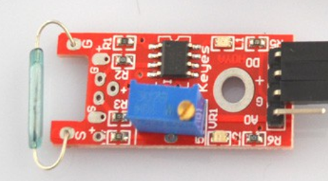

## <center> 大磁簧开关模块 ##
- 产品介绍
  - > 磁簧模块和数字13接口自带LED搭建电路，制作磁厂指示灯利用数字13接口自带的LED，将磁簧传感器接口接入数字3接口，当磁簧传感器测到有磁场信号的时候，LED亮，反正则灭
  - 
  - 产品特点
    - 信号干净，波形好，超过15mA
    - 工作电压3.3-5V
    - 输出形式：数字开关量输出(0和1)
    - PCB尺寸3.2cm*1.4cm
  - 引脚
    - VCC&ensp;&emsp;&emsp;&emsp;3.3 - 5V
    - GND&ensp;&emsp;&emsp;&emsp;接地
    - DO &ensp;&emsp;&emsp;&emsp;数字信号(0-1)
    - AO &ensp;&emsp;&e*msp;&emsp;模拟信号
  - **有磁场接近的时候，输出低电平，否则输出高电平**
  - ```c
    #include <8052.h>
    #define DO P2_0;
    /**
      * 磁簧传感器->可做开关
      * 有磁场接近的时候，输出低电平，若没有，输出高电平
    */
      void main(){
          P1 = 0X0E;
          while(1){
              P0 = DO;
          }
}
    ```
