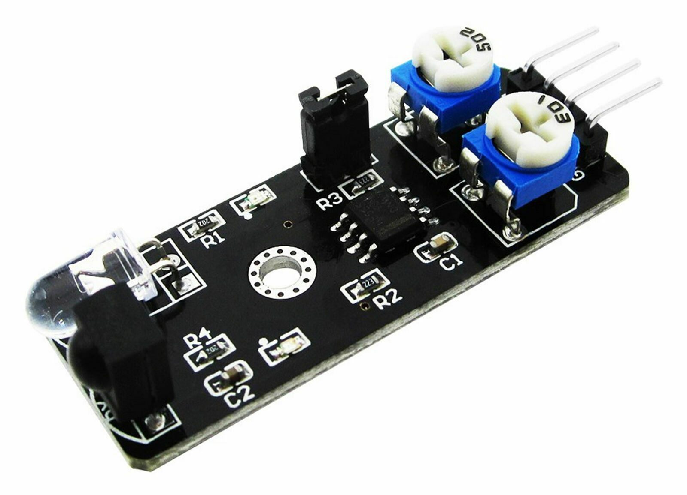

## 
 智能小车避障碍传感器模块 ##
- 实物图

- 特点
  - 距离远
  - 红外传感器
  - 光电开关
- 用法
  - 感应到物体输出0，未感应到输出1。可以直接与3V和5V单片机I/O口相连
  - 感应距离2~40cm,距离远，抗干扰能力强
    > 由于是光电元件，是检测光线反射率，所以不同的物体或许得到的距离不同，物体颜色越深越接近黑色，距离越短。
  - 传感器3V-6V供电，范围宽，适合3V到5V的单片机
  - 使能端，EN等于1的时候传感器不工作，等于0的时侯工作，传感器上跳线帽,保证EN持续接地，要使用EN的话，需要拔掉跳线帽 