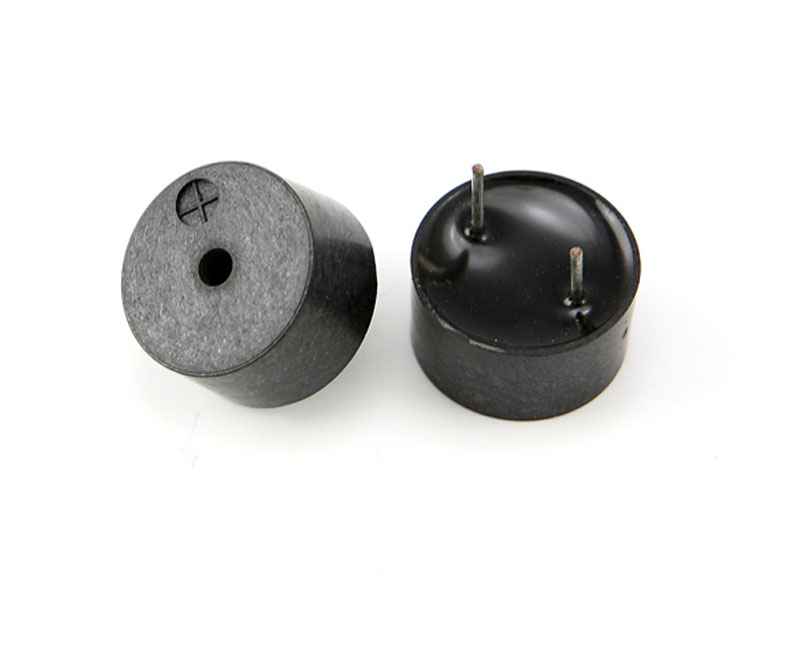

## 
 有源蜂鸣器和无源蜂鸣器 ##
- 产品介绍
  - > 工作电压3.3-5
  
  - 区别：
    * 源代表的并非是电源，而是震荡源。
    * 如何区分？
      > &emsp;&emsp;接通电源后，无源蜂鸣器只会响一声。  
      &emsp;&emsp;有源蜂鸣器可以持续发声  
    * 使用情况
      > &emsp;&emsp;若是要发出复杂的声音，比如：到软米发所拉稀，则需要无源蜂鸣器使用方波实现。 
      &emsp;&emsp;若是不要求发出复杂的声音，仅仅作为报警使用，则可以使用有源蜂鸣器，持续给高电平则会持续发声。
  - 引脚
    - VCC&ensp;&emsp;&emsp;&emsp;3.3 - 5V
    - GND&ensp;&emsp;&emsp;&emsp;接地
    - S&ensp;&emsp;&emsp;&emsp;输入控制