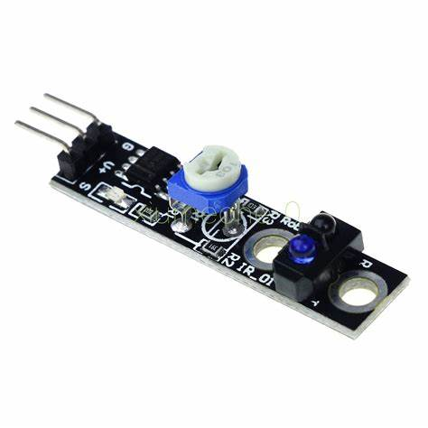

# <center> 红外传感模块 #
## <center> TCRT5000 #
- 实物图：
  
- 原理
  > 传感器的红外发射二极管不断发射红外线，当发射出的红外线没有被反射回来或被反射回来但强度不够大时，光敏三极管一直处于关断状态，此时模块的输出端为低电平，指示二极管一直处于熄灭状态；被检测物体出现在检测范围内，红外线被反射回来且强度足够大。光敏三极管饱和，此时模块的输出端为高电平，指示二极管被点亮。
- 产品介绍
  - 检测反射距离：1mm~25mm
  - 比较器输入，信号干净，波形好，驱动能力强，超过15mA
  - 配电位器调节灵敏度
  - 工作电压3.3V~5B
  - 输出形式：数字开关输出0/1
- 注意事项
  - 使用中光电传感器的前端面与被检测的工作或物体表面必须保持平行，这样光电传感器的转换效率最高
  - 光电传感器必须安装在没有强光直接照射的地方，因为强光中的红外光将影响接收管的正常工作。
  - 光电传感器长时间工作时红外接收管的最大工作电流不应超过250uA
- 引脚
  - VCC 接电源正极
  - GND 接电源负极
  - DO TTL开关信号输入
  > 一般的还会有AO引脚，做模拟信号的输出，不同距离输出不同的电压。
- **碰到黑色输出高电平，注意是存在有效范围的，下限不为0**
- 样例程序
  ```c
  #include <8052.h>
  #define A0 P3_0
  void main(){
      P1 = 0X0E;
      while(1){
          if(A0 == 1)   P0 = 0XFF;
          else if(A0 == 0) P0 = 0X00;
      }
  }
  ```