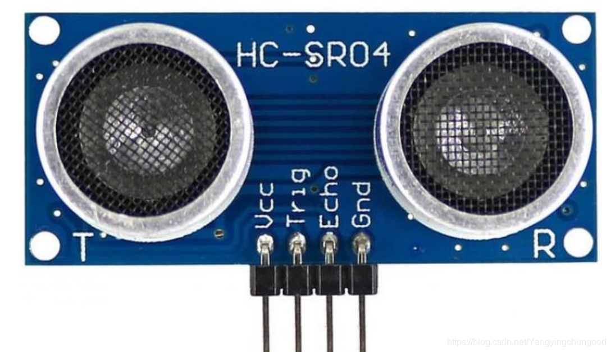

# <center> 超声波传感器 #

- 产品特点
  - 工作电压 5V
  - 最小静态电流 小于2mA
  - 感应角度，不大于15度
  - 探测距离：2cm-400cm
  - 高精度：可达到0.3cm
- 接口定义
  - VCC 电压
  - Trig    控制端
  - Echo    接收端
  - GND 接地
- 
- 使用方法
>&emsp;&emsp;控制端口发射一个10US以上的高电平，就可以在接收口等待高电平输出，一有输出就可以开定时器计时，当此口变成低电平就可以读定时器的值，此时接位此次的测距的时间，方可算出距离。
- 工作原理
  1. 至少给10us的高电平信号/TRIG
  2. 模块自动发送8个40khz的方波，自动检测是否有信号返回。
  3. 有信号返回，通过ECHO输出一个高电平，高电平持续时间就是超声波从发射到返回的时间，测距距离=（高电平时间*340)/2
- 注意事项
  - 不宜带电连接，先让GND接地，否则会影响模块工作
  - 测距时，被测模块的面积不少于0.5米且尽量平整。否则会影响测试结果。
```c
/**
 * TRIG 给是模块输入端，给一个持续10us以上的高电位
 * 等待ECHO输出高电位，计时高电位的时间，然后按照光速计算即可。
*/

/**
 * TRIG 给是模块输入端，给一个持续10us以上的高电位
 * 等待ECHO输出高电位，计时高电位的时间，然后按照光速计算即可。
*/

#include <8052.h>
unsigned char array[] = {0XC0,0XF9,0XA4,0XB0,0X99,0X92,0X82,0XF8,0X80,0X90,0X88,0X83,0XC6,0XA1,0X86,0X8E};
#define ECHO P2_7 //output
#define TRIG P2_0 //input
unsigned long time = 0;
/**
 * @author tmd
 * @brief open the ultrasonic wave mode
 * @return void
*/
void open_the_ultrasonic_wave();
/**
 * @author tmd
 * @brief sleep 10us
 * @return void
*/
void sleep();
/**
 * @author tmd
 * @brief LED display
 * @param time time(ms)
*/
void LED(unsigned long time);

void main(){
    TRIG = 0;
    open_the_ultrasonic_wave();
    while(1)
        LED(time);
}
void open_the_ultrasonic_wave(){
    EA = 1;  //使能总中断
    ET0 = 1;  //计时器1的中断
    TRIG = 0; //输入关闭
    TMOD = 0X01; //记时模式1
    TH0 = 0XFF; //计时器初值高四位
    TL0 = 0XF6; //计时器初值低四位
    ECHO = 0; //输出关闭
    TRIG = 1; //打开输入
    for(int a = 0; a <= 20;++a); //sleep
    TRIG = 0; // 关闭输入
    while(!ECHO); //等待高电平
    TR0 = 1; //打开计时器
    while(ECHO); //等待低电平
    TR0 = 0; //关闭计时器
}
void interrupt() __interrupt 1{
    TH0 = 0XFF;
    TL0 = 0XF6;
    ++time;
}
void LED(unsigned long time){
    static unsigned char stap = 0; 
    switch (stap){
        case 0:{
            P0 = 0XFF;
            P1 = 0X08;
            P0 = array[time % 10];
            break;
        }
        case 1:{
            P0 = 0XFF;
            P1 = 0X09;
            P0 = array[time / 10 % 10];
            break;
        }
        case 2:{
            P0 = 0XFF;
            P1 = 0X0A;
            P0 = array[time / 100 % 10];
            break;
        }
        case 3:{
            P0 = 0XFF;
            P1 = 0X0B;
            P0 = array[time / 1000 % 10];
            break;
        }
        case 4:{
            P0 = 0XFF;
            P1 = 0X0C;
            P0 = array[time / 10000 % 10];
            break;
        }
    }
    stap = (stap + 1) % 5;
    P0 = 0XFF;
    P1 = 0x0E;
    P0 =time;
}
```