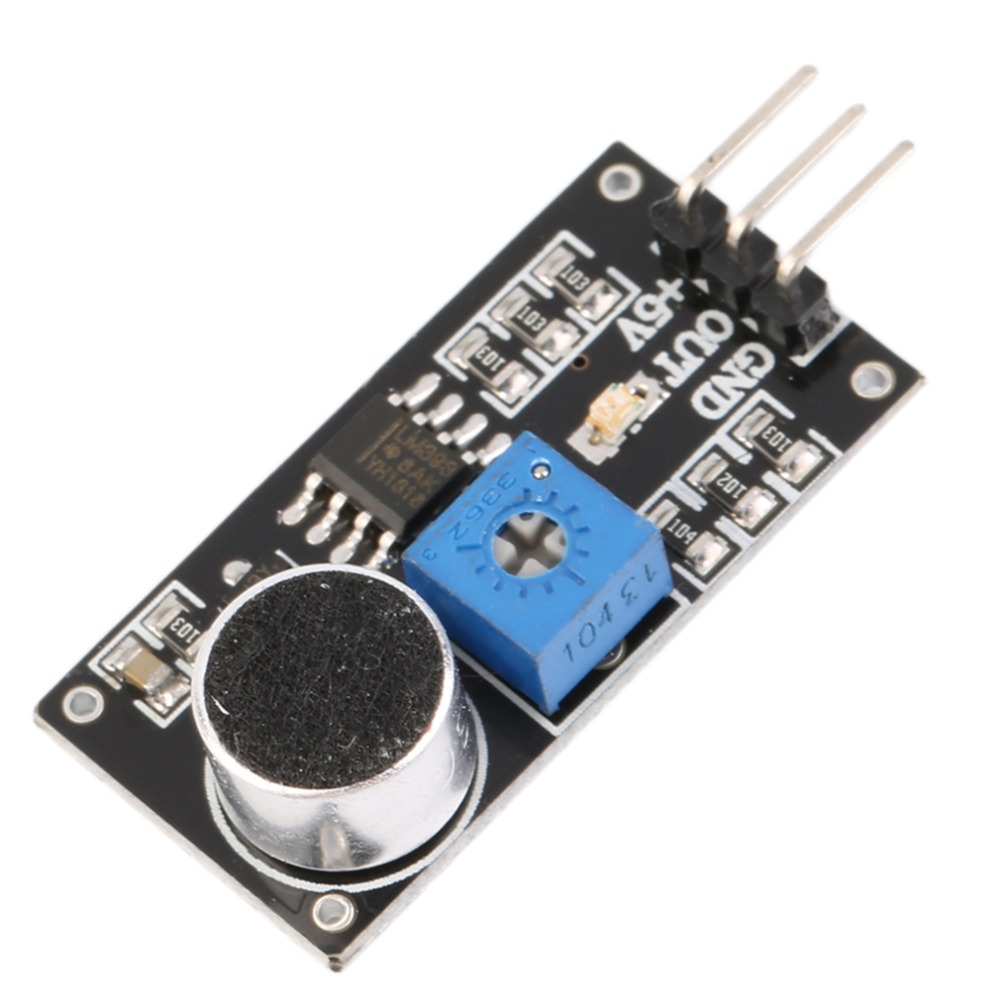

## <center> 高感度声音检测模块 ##
- 实物图

- 用于声音检测
- 模块有 2 个输出：
  - 1. AO，模拟量输出，实时输出麦克风的电压信号
  - 2. DO，当声音强度到达某个阀值时，输出高低电平信号，
  - 3.  \[阀值-灵敏度可以通过电位器调节\]
- 模块特点：
  1. 有 3mm 的安装螺丝孔
  2. 使用 5v 直流电源供电
  3. 有模拟量输出
  4. 有阀值翻转电平输出
  5. 高感度麦克风，灵敏度高。
  6. 有电源指示灯
  7. 比较器输出有指示灯
- **当分贝高于设定阀值时输出高电位，当分贝弱于设定阀值时输出低电位**
- 引脚说明
  - +5V&ensp;&emsp;&emsp;&emsp;3.3 - 5V
  - GND&ensp;&emsp;&emsp;&emsp;接地
  - OUT&ensp;&emsp;&emsp;&emsp;输入控制
- 样例程序
```c
    #include <8052.h>
    #define DO P2_0;
    /**
    * 高精度声音检测模块测试程序
    * 当分贝高于设定阀值时输出高电位，当分贝弱于设定阀值时输出低电位
    */
    void main(){
        P1 = 0X0E;
        while(1){
            P0 = DO;
        }
    }
```